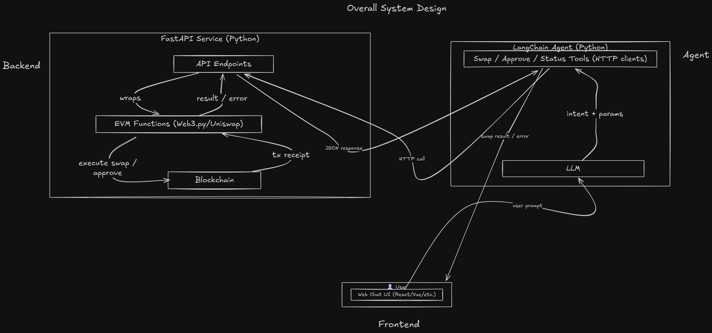

# Miye MVP

This project is a proof-of-concept MVP of Miye. It combines:

- 🌀 **AutoSwap SDK** – for token swap aggregation on StarkNet
- 🧑‍💻 **FastAPI (Python)** – wraps the SDK into HTTP/Websocket endpoints
- 🤖 **LangChain Agent (Python)** – interprets user intent and calls the backend endpoints
- 💬 **Web Chat UI** – lightweight frontend for user interaction

## 🚀 System Overview

The project enables users to interact with the AutoSwap SDK via natural language.
A user can say things like:

> "Swap 10 ETH for USDC"

And the LangChain agent will:

1. Parse the intent & parameters (token, amount, action)
2. Call the FastAPI backend endpoint (`/swap`)
3. Backend executes the swap using the EVM functions
4. User gets a result/transaction receipt in the chat

## 🏗️ Architecture



## 📂 Repository Structure

```
.
├── backend/              # FastAPI backend + EVM function wrapper
├── agent/                # Python LangChain agent
├── frontend/             # Web chat UI
├── README.md             # Project overview
├── 
```

## ⚡ Quick Start

### Clone the repo

```bash
git clone https://github.com/kingksjo/swap-agent.git
cd swap-agent
```