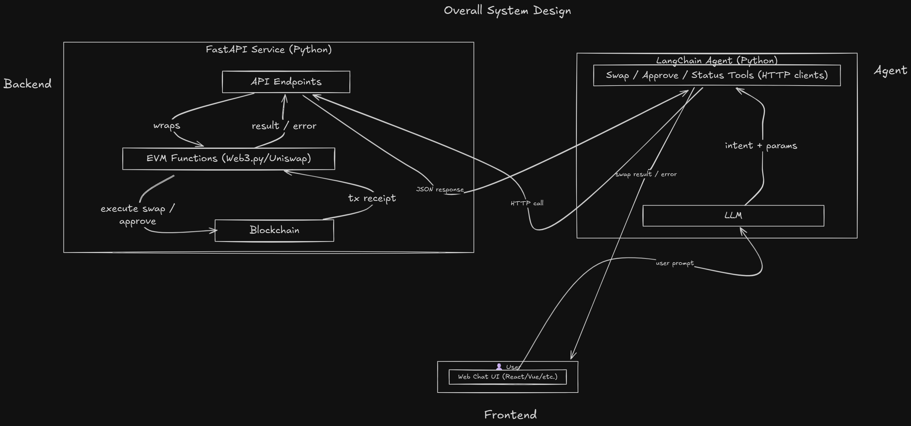

# Miye (Swap Agent)

Miye is an intelligent, conversational AI agent that simplifies DeFi interactions. Instead of navigating complex DEX interfaces, users can simply say **"Swap 1 ETH for USDC"**, and Miye will orchestrate the transaction for them.

> **Note:** This project is a Minimum Viable Product (MVP) designed for the **Base** ecosystem.

---

## Key Features

*   **Natural Language Interface**: Chat with the agent to express your intent.
*   **AI-Powered Proposals**: The backend (LangGraph + Gemini) parses intent and finds the best route.
*   **Non-Custodial Execution**: The agent *proposes* the transaction, but **YOU** execute it via your own wallet (Metamask, Coinbase Wallet, etc.) on the frontend.
*   **Security First**:
    *   Strict allowlists for Tokens and Routers to prevent malicious contract interactions.
    *   Frontend validation ensures the agent cannot trick you into signing a bad transaction.
*   **Multi-Environment**: Seamlessly switch between **Base Sepolia** (for testing) and **Base Mainnet** (for production).

---

## Architecture

The system follows a **Proposal-Execution** model:

1.  **User**: "Swap 0.01 ETH for USDC"
2.  **Agent (Backend)**: Parses intent, fetches quotes, and returns a JSON **Transaction Proposal**.
3.  **Frontend**: 
    *   Validates the proposal against a security allowlist.
    *   Renders a UI Card for user review.
4.  **User**: Clicks "Execute Swap".
5.  **Wallet**: Signs and broadcasts the transaction directly to the blockchain.



### Tech Stack

| Component | Technologies |
| :--- | :--- |
| **Frontend** | React, Vite, Tailwind CSS, **RainbowKit**, **Wagmi**, **Viem** |
| **Backend** | Python, **FastAPI**, **LangGraph**, **Google Gemini** (LLM) |
| **Blockchain**| Base (Sepolia & Mainnet), Uniswap V3 |

---

## Quick Start

### Prerequisites
*   Node.js (v18+)
*   Python (v3.11+)
*   A Google Gemini API Key
*   A WalletConnect Project ID (for RainbowKit)

### 1. Backend Setup (Agent)

The agent runs on port `8000`.

```bash
cd agent

# Create virtual environment
python -m venv venv
source venv/bin/activate  # On Windows: venv\Scripts\activate

# Install dependencies
pip install -r requirements.txt

# Configure Environment
# Copy the example and add your API keys
cp .env.example .env
# Edit .env and set:
# - GOOGLE_API_KEY (Required)
# - BASE_CHAIN_ID=base_sepolia (Default)
```

**Run the Backend:**
```bash
uvicorn app.main:app --reload
```

### 2. Frontend Setup (UI)

The frontend runs on port `5173`.

```bash
cd frontend

# Install dependencies
npm install

# Configure Environment
cp .env.example .env
# Edit .env and set:
# - VITE_WC_PROJECT_ID (Required from cloud.walletconnect.com)
# - VITE_USE_MOCK_DATA=false (To talk to real backend)
```

**Run the Frontend:**
```bash
npm run dev
```

---

## Switching Environments
Use Miye on Base Sepolia for development and Base Mainnet for production.

### To Use Testnet (Default)
**Backend (`agent/.env`):**
```ini
BASE_CHAIN_ID=base_sepolia
UNISWAP_ROUTER_ADDRESS=0x94cC0AaC535CCDB3C01d6787D6413C739ae12bc4
```

### To Use Mainnet (Production)
**Backend (`agent/.env`):**
```ini
BASE_CHAIN_ID=base
UNISWAP_ROUTER_ADDRESS=0x2626664c2603336E57B271c5C0b26F421741e481
```

> **Note:** The frontend automatically adapts its validation rules based on the chain ID sent by the backend. You do not need to change frontend code to switch environments.

---

## Security

This project implements a **"Trust but Verify"** security model:
1.  **Agent = Untrusted**: The frontend treats the AI agent as an untrusted source.
2.  **Allowlists**: The frontend (`security.ts`) has a hardcoded list of verified Token and Router addresses for both Testnet and Mainnet.
3.  **Strict Validation**: If the agent proposes a swap with an unknown router or token, the frontend **rejects** it immediately.

---

## 📂 Repository Structure

```
.
├── agent/                # Python Backend
│   ├── app/              # FastAPI Application & Config
│   ├── graph/            # LangGraph Agent Logic
│   ├── tools/            # Swap & Quote Tools
│   └── requirements.txt  # Python Dependencies
├── frontend/             # React Frontend
│   ├── src/
│   │   ├── components/   # UI Components (Chat, SwapCard)
│   │   ├── lib/          # Logic (AgentClient, Security, SwapExecution)
│   │   └── data/         # Mock Data
│   └── package.json      # Node Dependencies
└── README.md             # Project Documentation
```
