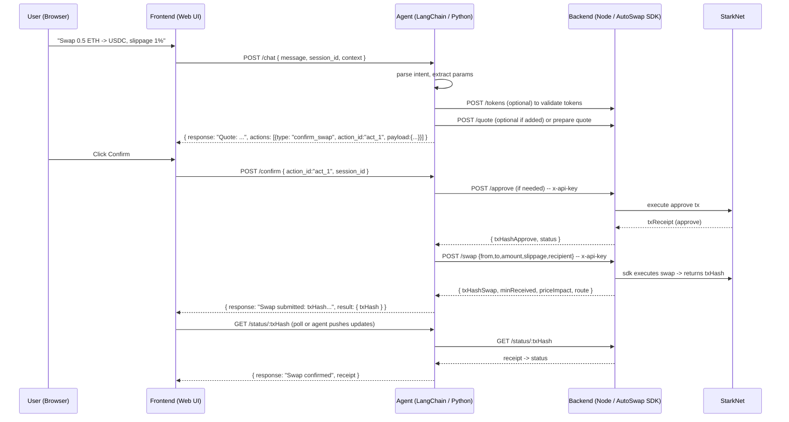

# WORKFLOW\.md — Integration & System Contract (Frontend ↔ Agent ↔ Backend)

> **Single source of truth** for how the pieces connect, what requests/responses look like, exact endpoints, ports, env variables, error codes, and the step-by-step swap flow.
> This file has been cross-checked against the `BACKEND_SETUP.md`, `AGENT_SETUP.md`, and `FRONTEND_SETUP.md` drafts and standardizes ports, headers, and payload shapes so there are **no mismatches**.

---

## 1 — Canonical configuration (ports & env)

Make these the canonical defaults for the repo. Update the other markdown files to use these values.

* **Backend (Node / TypeScript)**

  * Port: **`8080`**
  * Env file: `backend/.env`
  * Key env vars (subset):

    * `PORT=8080`
    * `API_KEYS=local-dev-key-1`
    * `STARKNET_RPC=...`
    * `SERVER_ACCOUNT_ADDRESS=0x...`
    * `SERVER_PRIVATE_KEY=0x...`
    * `AUTOSWAPPR_ADDRESS=0x...`

* **Agent (Python / LangChain)**

  * Port: **`8000`** (FastAPI / uvicorn)
  * Env file: `agent/.env`
  * Key env vars (subset):

    * `OPENAI_API_KEY=...`
    * `BACKEND_URL=http://localhost:8080`  ← *points to the backend above*
    * `AUTOSWAP_API_KEY=local-dev-key-1`  ← used by agent when calling backend
    * `AGENT_API_KEY=dev-agent-key` *(optional — used to protect agent endpoints)*

* **Frontend (Web UI, Vite/React)**

  * Dev server (Vite default) typically **5173**, but not critical; it calls the agent.
  * Env file: `frontend/.env.local`
  * Key env vars:

    * `VITE_AGENT_URL=http://localhost:8000`
    * `VITE_AGENT_KEY=dev-agent-key` *(optional — used if agent enforces an API key)*

> **Action:** Make sure `BACKEND_SETUP.md` lists `PORT=8080` and `AGENT_SETUP.md` sets `BACKEND_URL=http://localhost:8080`. The frontend `VITE_AGENT_URL` must point at the agent: `http://localhost:8000`.

---

## 2 — System diagram (sequence + flow)

### Mermaid sequence (user flow for a confirmed swap)



---

## 3 — API contract (detailed)

> Canonical endpoint and payload definitions. All requests/responses use JSON. Timeouts: backend calls to RPC may be long; agent should use timeouts (30s) and show pending status to users.

### 3.1 Agent API (Python) — **EXPOSES to Frontend**

**POST /chat**

* Purpose: Send user prompt to agent. Agent parses and returns a human response and optional recommended actions.
* Headers: `Content-Type: application/json`, optionally `x-agent-key: <AGENT_API_KEY>`
* Request body:

```json
{
  "message": "Swap 0.5 ETH to USDC with 1% slippage",
  "session_id": "optional-uuid",
  "context": {
    "recipient": "0xabc...",        // optional, frontend can supply
    "defaults": { "slippage_bps": 100 }
  }
}
```

* Response (MVP canonical — **simple**):

```json
{
  "response": "I found a route: ETH -> PoolA -> USDC. Estimated min received: 1500 USDC. Confirm to execute.",
  "action": {
    "type": "confirm_swap", 
    "action_id": "act_abc123",
    "payload": {
      "fromToken": "ETH",
      "toToken": "USDC",
      "amount": "0.5",
      "slippageBps": 100,
      "recipient": "0xabc..."
    }
  }
}
```

> Notes: For MVP the `action` field is optional — the frontend must gracefully degrade if only `response` exists. A richer `messages[]` schema is a documented *future enhancement*.

**POST /confirm**

* Purpose: Frontend posts back to agent to confirm an action the agent proposed.
* Headers: same as above.
* Body:

```json
{
  "action_id": "act_abc123",
  "session_id": "optional-uuid",
  "confirm": true
}
```

* Response (success initiated):

```json
{
  "response": "Executing swap now. Submitted tx: 0xtxhash123. I'll notify you when it's confirmed.",
  "result": {
    "txHash": "0xtxhash123",
    "status": "PENDING"
  }
}
```

**GET /status/\:txHash** (optional)

* Purpose: Frontend or agent can poll swap status via agent (agent proxies to backend).
* Response:

```json
{
  "txHash": "0xtxhash123",
  "status": "PENDING|ACCEPTED_ONCHAIN|REJECTED|NOT_RECEIVED",
  "receipt": { /* optional execution receipt */ }
}
```

---

### 3.2 Backend API (Node) — **EXPOSES to Agent**

> All backend endpoints require `x-api-key: <AUTOSWAP_API_KEY>` header.

**GET /health**

* Response: `{ "ok": true }`

**GET /tokens**

* Purpose: Return curated allow-list for the app per chain.
* Response:

```json
{
  "tokens": [
    { "symbol": "ETH", "address": "0x...", "decimals": 18, "chain": "sepolia" },
    { "symbol": "USDC", "address": "0x...", "decimals": 6, "chain": "sepolia" }
  ]
}
```

**POST /approve**

* Body:

```json
{
  "token": "0xTOKEN_ADDRESS",
  "spender": "0xAUTOSWAPPR_ADDRESS",  // defaulted by backend
  "amountWei": "1000000000000000000"
}
```

* Response:

```json
{ "txHash": "0xabc", "status": "PENDING" }
```

**POST /swap**

* Body (MVP normalized: human `amount` string; backend will convert to wei using token decimals):

```json
{
  "fromToken": "0xFROM",
  "toToken": "0xTO",
  "amount": "0.5",               // user-facing decimal string
  "slippageBps": 100,
  "recipient": "0xabc...",
  "isToken1": true               // optional, SDK-specific
}
```

* Response (success):

```json
{
  "txHash": "0xtxhash1234",
  "minReceived": "1500.0",
  "route": ["PoolA", "PoolB"],
  "priceImpactBps": 45,
  "gasEst": 0.002
}
```

* Normalized error response (HTTP 400+):

```json
{
  "error": "INSUFFICIENT_ALLOWANCE",
  "message": "Allowance is less than required for this swap."
}
```

**GET /status/\:txHash**

* Response: same as agent `/status` response (backend is authoritative about final receipts).

---

## 4 — Error codes and how each layer must handle them

> Backend returns stable **error codes** and a human message. The agent must map these codes to user-friendly guidance and optionally trigger corrective actions (e.g., call `/approve`).

Canonical backend error codes (MVP):

* `INSUFFICIENT_FUNDS` — user wallet/server wallet lacks funds.

  * Agent: tell user they have insufficient balance and suggest reducing amount.

* `INSUFFICIENT_ALLOWANCE` — token allowance insufficient.

  * Agent: propose an `approve` action; if user confirms, agent calls `POST /approve` on backend.

* `SLIPPAGE` — price moved beyond allowed slippage.

  * Agent: present new quote if possible and ask to retry with higher slippage.

* `SWAP_FAILED` — generic failure (liquidity, RPC error).

  * Agent: show error; optionally suggest retry or alternative route if backend can provide.

* `RATE_LIMIT` — backend rate-limited the agent.

  * Agent: retry with backoff or inform the user to try again.

**Agent behavior rules**:

1. If the backend returns `INSUFFICIENT_ALLOWANCE`, agent must not auto-execute an `approve` without explicit user confirmation. Instead: ask the user, then call `/approve` if confirmed.

2. If backend returns `SLIPPAGE`, present the cause and ask whether to increase `slippageBps` or cancel.

3. For transient errors (429, 502, network timeouts), agent should retry with exponential backoff up to a short limit (3 tries) and then inform the user.

---

## 5 — Session & memory semantics

* **Session\_id**: Frontend should send a `session_id` (UUID) with every user message to let the agent maintain short-term conversation context (e.g., previous tokens, last quote). If missing, agent can generate one and return it to the frontend.

* **Agent memory**: Keep ephemeral memory per `session_id`. Persist for the duration of the user session (in-memory or lightweight cache). Do NOT store private keys or secrets in memory.

* **Conversation state examples**:

  * After the agent proposes `action_id: act_1` for a quote, the agent should store the action payload in memory keyed by `action_id` so that `POST /confirm` can retrieve and execute it.

---

## 6 — Who normalizes amounts & decimals?

* **Frontend**: sends the user-facing decimal string (e.g., `"0.5"`) as `amount`.
* **Agent**: passes the `amount` through to the backend (can also pre-validate).
* **Backend**: authoritative normalizer — convert human `amount` → `amountWei` using token `decimals` from `GET /tokens`. This centralizes decimal handling and prevents mismatches across languages.

> Rationale: backend has `TOKEN_ADDRESSES` and `decimals` mapping; it’s safer to normalize there.

---

## 7 — End-to-end swap flow (step-by-step with examples)

### User flow (final, explicit)

1. **User** types: `"Swap 0.5 ETH to USDC with max slippage 1%, send to 0xabc..."`.
2. **Frontend** posts to agent:

```http
POST http://localhost:8000/chat
Content-Type: application/json
x-agent-key: dev-agent-key

{
  "message":"Swap 0.5 ETH to USDC with max slippage 1%, send to 0xabc",
  "session_id":"sess-123",
  "context":{"recipient":"0xabc","defaults":{"slippage_bps":100}}
}
```

3. **Agent** does:

   * NLU / parsing → `{ fromToken: "ETH", toToken: "USDC", amount:"0.5", slippageBps: 100, recipient:"0xabc" }`
   * (optional) `GET /tokens` on backend to validate tokens.
   * Prepare a quote either via backend `/quote` (if implemented) or request the backend to prepare/execute after confirmation.

4. **Agent** responds (MVP):

```json
{
  "response": "I found a route: ETH -> PoolA -> USDC. Estimated min received: 1500 USDC. Confirm to execute.",
  "action": {
    "type":"confirm_swap",
    "action_id":"act_1",
    "payload":{ "fromToken":"ETH","toToken":"USDC","amount":"0.5","slippageBps":100,"recipient":"0xabc"}
  }
}
```

5. **Frontend** renders the message and a **Confirm** button.

6. **User** clicks Confirm → Frontend POST `/confirm` to agent:

```json
{ "action_id":"act_1", "session_id":"sess-123", "confirm":true }
```

7. **Agent** executes:

   * If allowance required: calls backend `POST /approve` (only after asking or with prior confirmation).
   * Calls backend `POST /swap` with the payload and header `x-api-key: local-dev-key-1`.
   * Receives `{ txHash, minReceived, route, priceImpactBps }`.

8. **Agent** replies:

```json
{
  "response": "Swap submitted — txHash: 0xtxhash123. I will check status and update you when confirmed.",
  "result": { "txHash":"0xtxhash123", "status":"PENDING" }
}
```

9. **Agent** (or frontend via agent) polls `GET /status/:txHash` until the backend returns final confirmation, then reports success/failure.

---

## 8 — Security & practical demo advice

* **API keys**:

  * Backend uses `x-api-key` (must be present on any call from the agent).
  * Agent may enforce `x-agent-key` for calls from the frontend.
* **Server wallet**:

  * For the hackathon MVP: backend uses a *server wallet* with only testnet funds. **Do NOT** use a mainnet production wallet in demos.
* **CORS**: backend should restrict allowed origins to your frontend dev origin (or allow localhost for hackathon).
* **No secrets in frontend** — frontend only passes `VITE_AGENT_KEY` if agent enforces it; keep `AUTOSWAP_API_KEY` and `SERVER_PRIVATE_KEY` in backend `.env` only.
* **Logging**: redact private key and full private payloads. Log txHashes and request IDs.

---

## 9 — Testing & validation plan (integration tests)

**Minimal local manual smoke test**:

1. Start backend:

   * `cd backend && npm run dev` (listening on `http://localhost:8080`)
2. Start agent:

   * `cd agent && uvicorn main:app --reload --port 8000`
   * Ensure `BACKEND_URL=http://localhost:8080` in `agent/.env`
3. Start frontend:

   * `cd frontend && npm run dev` (Vite)
   * Ensure `VITE_AGENT_URL=http://localhost:8000` in `frontend/.env.local`

**Smoke cURL flow**:

* Chat:

```bash
curl -X POST http://localhost:8000/chat \
  -H 'Content-Type: application/json' \
  -d '{"message":"Swap 0.01 ETH to USDC","session_id":"s1"}'
```

* Confirm (if action\_id returned by agent is `act_1`):

```bash
curl -X POST http://localhost:8000/confirm \
  -H 'Content-Type: application/json' \
  -d '{"action_id":"act_1", "session_id":"s1", "confirm":true}'
```

* Poll status (via agent or backend):

```bash
curl -X GET "http://localhost:8000/status/0xtxhash123"
```

**Automated integration tests** (recommended):

* Mock backend SDK responses for unit tests.
* Add one end-to-end test against Sepolia with a tiny notional to ensure RPC wiring.

---

## 10 — Future / Stretch integration points (clearly separated from MVP)

1. **Rich `messages[]` schema** — replace the simple `{ response, action }` with a typed `messages` array for a richer UI.
2. **`/quote` endpoint** on backend to get multi-route comparisons without executing.
3. **Non-custodial flow** — backend returns calldata / unsigned tx to the agent → agent forwards to frontend → user signs with StarkNet wallet → broadcast by backend or directly by frontend.
4. **Websockets / SSE** — agent pushes status updates to frontend instead of polling.
5. **Rate-limiting & quotas** — per-session or per-user quotas for public demos.

---

## 11 — Checklist (preflight before demo)

* [ ] Backend listening on `http://localhost:8080` and returns OK for `/health`.
* [ ] Agent listening on `http://localhost:8000` and responds to `/chat`.
* [ ] `agent/.env` `BACKEND_URL` set to `http://localhost:8080` and `AUTOSWAP_API_KEY` equals a key listed in backend `API_KEYS`.
* [ ] Frontend `VITE_AGENT_URL` set to `http://localhost:8000`.
* [ ] Test tokens in backend `GET /tokens` match demo token addresses (Sepolia/testnet).
* [ ] Server wallet funded with small test tokens and set via `SERVER_PRIVATE_KEY` in backend `.env`.
* [ ] All services log request IDs and redact secrets.

---

## 12 — Appendix — Quick mapping summary

* Frontend → Agent

  * Endpoint: `POST /chat` (port 8000)
  * Auth: optional `x-agent-key`
  * Canonical response: `{ response: string, action?: { type, action_id, payload } }`

* Agent → Backend

  * Endpoints: `GET /tokens`, `POST /approve`, `POST /swap`, `GET /status/:txHash` (port 8080)
  * Auth: `x-api-key: <AUTOSWAP_API_KEY>`
  * Backend normalizes amounts and is authoritative.

---


