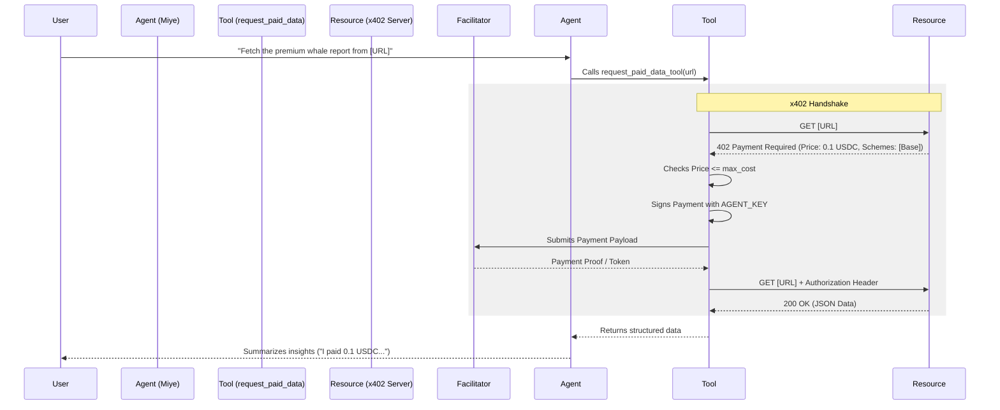

# x402 Protocol Implementation Plan: Autonomous Paid Data Access

## Overview
This document outlines the technical implementation plan for enabling **Miye** to act as an **Autonomous Economic Agent** using the [x402 Protocol](https://x402.org/). 

By integrating the `request_paid_data_tool`, Miye will be able to access "gated" or "premium" resources (APIs, reports, signals) that require micropayments, handling the negotiation and payment autonomously via a dedicated "petty cash" wallet.

## Product Context (The "Why")
**User Problem:** Users encounter valuable paid resources (e.g., "Whale Alert Report: 0.50 USDC") but face high friction to access them (connect wallet, sign transaction, pay gas, disconnect).
**Solution:** "Frictionless Delegation." The user authorizes Miye to spend small amounts from a pre-funded agent wallet. The agent handles the 402 Payment Required handshake instantly.

## Architecture

### 1. The "Buyer" Persona
Miye transitions from a passive tool to an active **Buyer**.
-   **Wallet:** Uses a dedicated `AGENT_PRIVATE_KEY` (server-side custody).
-   **Limits:** Strict `max_cost_usd` per interaction to prevent draining funds.
-   **Protocol:** Uses `x402` client to handle HTTP 402 responses, headers, and signature generation.

### 2. Implementation Flow



## Integration Steps

### Step 1: Dependencies
Add the x402 Python client to `agent/requirements.txt`.
```text
x402>=0.1.0
requests>=2.31.0
```

### Step 2: Configuration (`agent/app/config.py`)
Add support for the agent's spending wallet.
```python
# x402 / Agent Payment Config
ENABLE_X402 = os.getenv("ENABLE_X402", "true").lower() == "true"
AGENT_PRIVATE_KEY = os.getenv("AGENT_PRIVATE_KEY") # dedicated wallet for micropayments
```

### Step 3: The Tool (`agent/tools/request_paid_data.py`)
This tool encapsulates the logic of trying a URL, detecting a 402, and paying if authorized.

**Key Logic:**
1.  **Probe:** `requests.get(url)`
2.  **Detect:** `if status == 402`
3.  **Negotiate:** Parse `WWW-Authenticate` or `X-402-Gateway` headers for price and facilitator.
4.  **Guard:** Check `price <= max_cost_usd`.
5.  **Pay:** Use `x402.Client.pay()` or manual signature construction.
6.  **Fetch:** Retry request with auth headers.

### Step 4: Graph Integration (`agent/graph/`)
The Agent Graph needs to be aware of this new capability.

1.  **Nodes (`graph/nodes.py`):** Add `request_paid_data_node` which invokes the tool and returns the JSON result as a `ToolMessage`.
2.  **Routing (`graph/edges.py`):** Update `should_continue` to map `request_paid_data_tool` calls to the new node.
3.  **Workflow (`graph/workflow.py`):** Register the node and edges. Crucially, the edge from `request_paid_data` should point back to `agent`, allowing the LLM to interpret the bought data.

### Step 5: System Prompt (`graph/system_prompt.py`)
Teach Miye about its new economic power.

**Additions:**
-   **Tool Definition:** Explain `request_paid_data_tool`.
-   **Capability:** "You are x402 enabled. You can spend small amounts to get data."
-   **Constraint:** "Always inform the user you are using the agent wallet to pay."

## Security Considerations
1.  **Key Isolation:** `AGENT_PRIVATE_KEY` should **NEVER** be the user's main wallet key. It is a "hot wallet" with limited funds.
2.  **Spend Limits:** The tool enforces `max_cost_usd` (default $0.50).
3.  **URL Validation:** Ensure the agent doesn't send signatures to malicious endpoints blindly (though x402 signatures are scoped).

## Testing Strategy
1.  **Mock Server:** Run a local FastAPI endpoint that returns 402.
2.  **Integration Test:** Use `test_x402.py` (to be created) to verify the handshake logic without an LLM.
3.  **Chat Test:** Verify Miye correctly identifies when to use the tool based on natural language prompts (e.g., "Buy that report").
